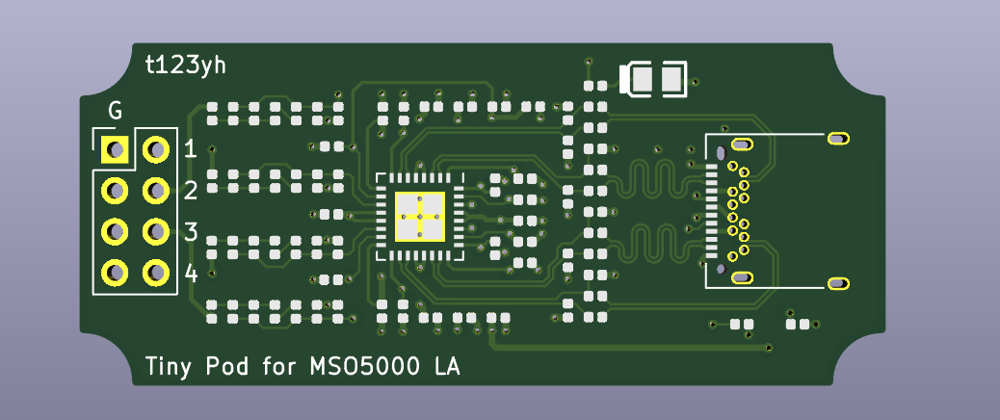

# Pod for Rigol MSO5000 Logic Analyzer

This is a pod for MSO5000. All components are in JLC SMT basic library.

See also [Original Project](https://gitlab.com/thmjpr/stm32f03_la_monitor/tree/master/PCB_Rev2).
